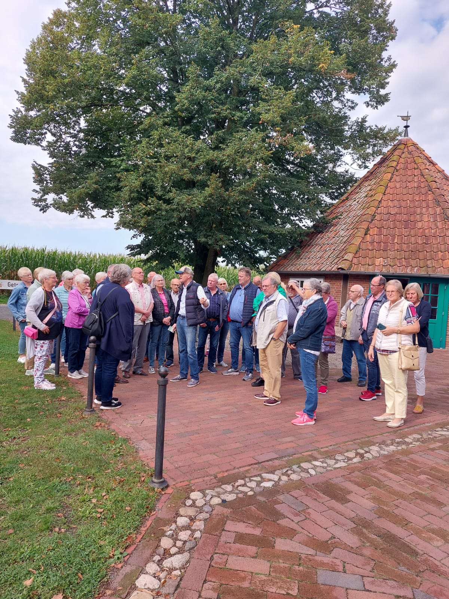

Bei sonnigem Reisewetter konnte Alfons Arkenau, der 1. Vorsitzende des Heimatvereins Halen, am Samstag, 16.09.2023, frühmorgens 36 Heimatfreunde zum Tagesausflug in den Nachbarkreis Vechta begrüßen. 

Auf dem Weg dorthin nahm man unterwegs das nun schon zur Tradition gewordene Frühstück am Bus im Burgpark in Dinklage ein. Gut gestärkt ging es dann weiter zur Schweger Mühle. Die Mühle wurde als Galerieholländer mit Steert und Segelflügel 1848 erbaut und seit 1962 mehrfach saniert. Das Mühlengebäude und die Mühleneinrichtung sind weitgehend im Originalzustand erhalten und funktionsfähig. Paul Arlinghaus, ein Vertreter des Freundeskreises Schweger Mühle, führte die interessierten Heimatfreunde aus Halen fachkundig durch die Mühle und erklärte leidenschaftlich deren Funktionsmechanismen. Heute ist die Schweger Mühle die einzige Mühle im Landkreis Vechta, die wieder mit Windkraft mahlen kann. Sie präsentiert sich mit ihren Nebengebäuden, dem Backhaus und dem Göpelhaus, in einer reizvollen Umgebung. Ganz in der Nähe befindet sich der Getreidegarten, in dem in den Sommermonaten historische Getreidearten wie Dinkel, Einkorn und Emmer, aber auch Buchweizen, Feldblumen und Ackerwildkräuter besichtigt werden können.

Nach diesen interessanten Ausführungen und einem schmackhaften Mittagessen fuhren die Heimatfreunde weiter zum Industriemuseum nach Lohne. Dort wird die 200-jährige Lohner Industriegeschichte mit großem Engagement bewahrt und für die Öffentlichkeit erlebbar gemacht. Eine Mitarbeiterin des Museums führte die Teilnehmer des Heimatvereins durch die 1000 qm große Ausstellungsfläche und erklärte anschaubar, wie aus dem kleinen Ort Lohne eine wirtschafts-starke „Stadt der Spezialindustrie“ wurde. Neben der Herstellung von Schreibfe-dern aus Gänsekielen sind u.a. die Moorforschung und Torfgewinnung, die Tabakverarbeitung, die Pinsel- und Bürstenherstellung sowie die Arbeit einer  Korken-fabrik Themen im Museum. 

Bei Kaffee und Kuchen ließen die Heimatfreunde diesen erlebnisreichen Tag ausklingen und traten dann die Heimreise nach Halen an.
